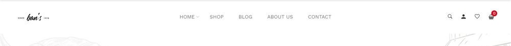
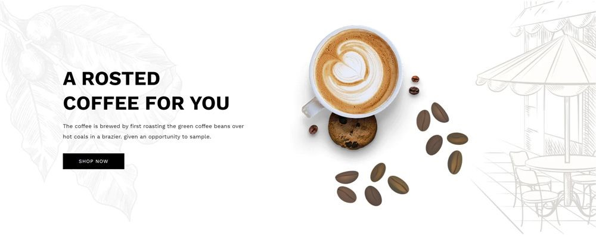
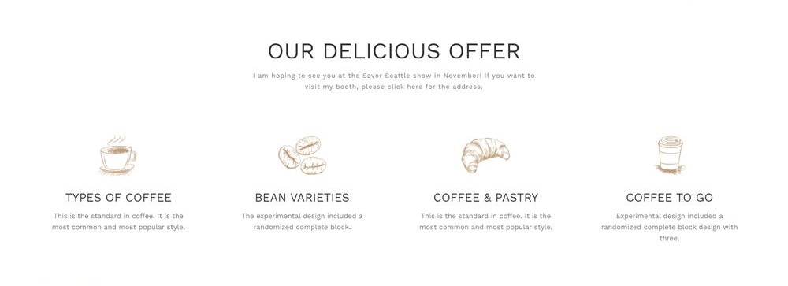
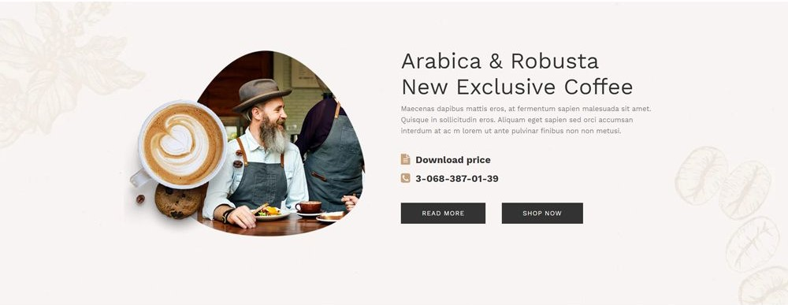
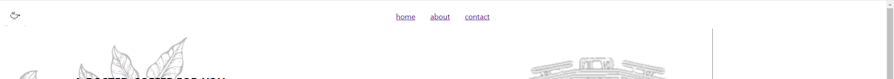
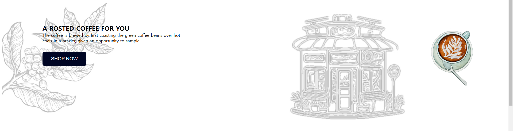
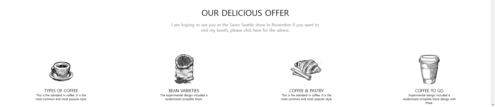
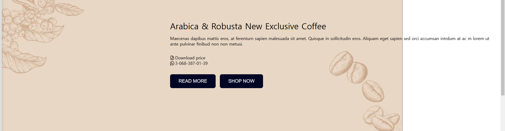

# 프로젝트 4번

## 목표

1. css 심화 학습 (멋있는 페이지 만들기)
2. 실습을 통한 html, css 학습

### 진행방식

레퍼런스 선정 > 레퍼런스 분석 > 사이트 제작 계획 > 사이트 제작 > 사이트 배포

clone coding을 진행하기 위해 적절한 레퍼런스를 탐색하여 선정했다. 선정된 레퍼런스의 구조를 분석하고 html, css 구조를 어떤 형식으로 제작할 지 계획했다. 최종적으로 계획에 따라 레퍼런스에서 간단한 기능만을 추가한 사이트를 제작, 배포하였다.

## 기획

위의 이미지에서 오른쪽 상단 부분을 없애고 중앙의 네비게이션과 왼쪽 상단의 로고만 구현한다. 중앙 네비게이션은 각 항목을 클릭할 시 항목에 맞는 페이지 위치로 이동한다.

배경 이미지 위에 텍스트, 버튼, 커피 이미지를 쌓는 방식으로 구현한다. 왼쪽 하단의 버튼에는 클릭 이외의 별도 기능은 추가하지 않는다.

상단에 타이틀을, 하단에는 4개의 이미지와 짧은 설명을 가로로 나열하여 삽입하는 형식으로 구현한다.

배경 이미지 위에 텍스트, 아이콘, 버튼을 쌓는 방식으로 구현하며 왼쪽의 이미지는 생략한다. 오른쪽 하단의 두 버튼에는 클릭 이외의 별도 기능은 추가하지 않는다.

## 서비스

### 네비게이션

왼쪽 상단에 커피잔 모양 로고를 삽입하고 중앙에 home, about, contact 네비게이션을 삽입하였다. 네비게이션은 중앙에서 로고 크기만큼 오른쪽으로 치우치게 구현하였다.

### 홈

배경 위에 텍스트와 커피잔 이미지, 버튼을 쌓았다. 커피 이미지는 화면의 오른쪽 기준으로 고정시켰다. 버튼을 클릭하면 색이 변화하도록 구현하였으나 별도의 기능은 추가하지 않았다.

### 어바웃

기획대로 구현하였다.

### 컨택

배경 위에 텍스트와 버튼을 쌓았다. 버튼을 클릭하면 색이 변화하도록 구현하였으나 별도의 기능은 추가하지 않았다.

## 피드백 [작성 x]

### 사이트 화면 일관성

## 아쉬운 점

스크롤을 내리면 네비게이션도 위로 올라가며 네비게이션을 이용하려면 다시 스크롤을 올려야 한다는 점이 불편했다. 네비게이션 부분의 디자인이 투박해 오히려 눈에 띄어 보완하면 더 좋을 것 같다. 창 크기를 조정할 시, 홈 화면의 커피 이미지가 너무 자유로이 움직여 어색해진다. 홈과 컨택 화면의 배경 크기가 적절하지 않아 화면 크기가 일관되지 않은 점, 각 페이지의 크기를 따로 지정해두지 않아 기본 화면 크기에서 아래 컨텐츠 또한 잘려서 보이는 점이 아쉬웠다.
